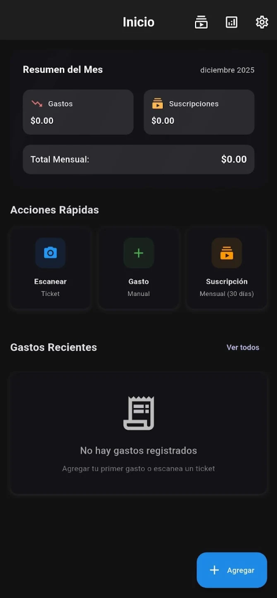
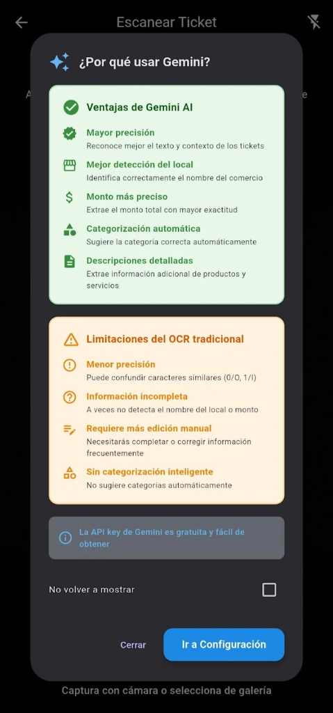
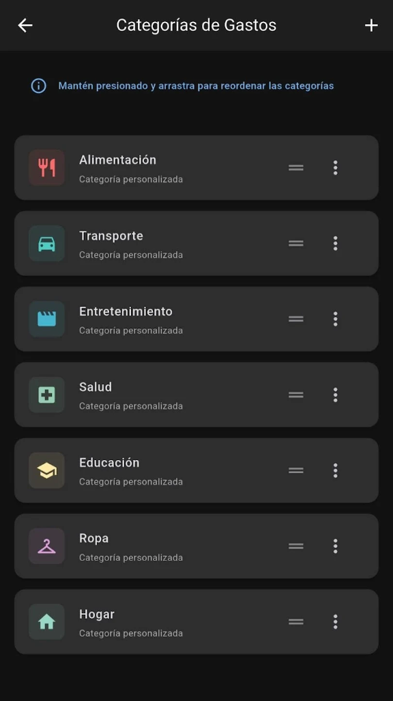
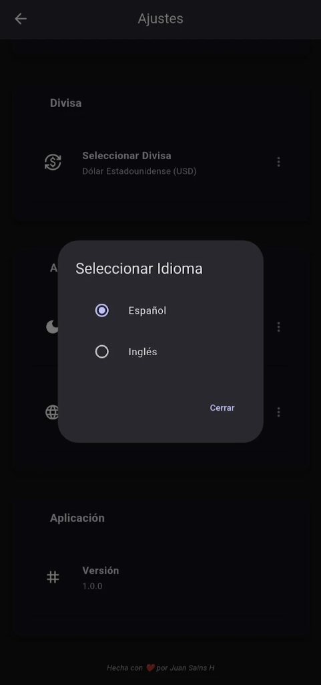
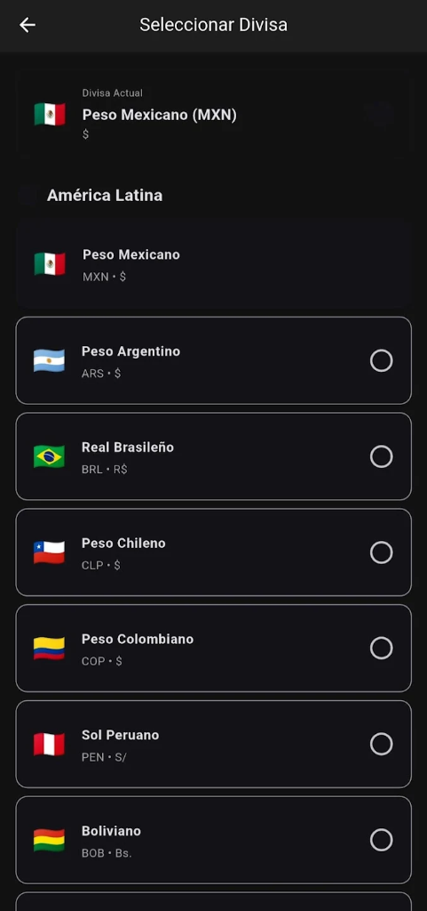

# 💰 Bolsillo App - Smart Finance Management

Bolsillo is a mobile application designed to offer total and simplified control of personal finances. Unlike other apps, Bolsillo integrates the power of **Artificial Intelligence (Google Gemini)** to automate data entry through the camera, making managing your expenses a matter of seconds.

  

  

## 🚀 Want to try the app? (Closed Beta)

Currently, **Bolsillo** is in a closed testing phase. To download and install it, it is **mandatory** to follow these two steps in order:

1. **Join the testers group**: 
   Join the [bolsillo-testers Google Group](https://groups.google.com/g/bolsillo-testers). 
   *(Note: This group will be deleted once the app goes to production).*

2. **Register as a tester**: 
   Once you are in the group, visit this link to accept the testing invitation: [Tester Registration on Google Play](https://play.google.com/apps/testing/com.juansains.bolsillo). 
   *Without the previous step, this link will not work.*

3. **Download from Play Store**: 
   After accepting the invitation, you can download the app from the official link: [Bolsillo on Play Store](https://play.google.com/store/apps/details?id=com.juansains.bolsillo).

## 💳 One-time Payment and Ownership
- **Pay Once**: Buy the app once and it's yours forever.
- **No Subscriptions**: Forget about monthly fees or recurring charges for using the app.
- **Full Ownership**: Your data and the app are permanently yours.

## ✨ Key Features

### 📸 AI Ticket Scanning (Powered by Gemini 1.5 Flash)
The crown jewel. Forget about manually transcribing amounts and business names.
- **Automatic Detection**: Point the camera at a physical ticket and the AI will extract the total amount, date, business name, and suggest the most suitable category.
- **Hybrid Processing**: Combines **Google ML Kit** for high-speed local OCR with **Google Gemini AI** for precise semantic interpretation of the content.

  

### 🔄 Subscription Management
Control those "small expenses" that, when added up, represent a large part of your budget.
- **Recurring Payments**: Register subscriptions like Netflix, Spotify, gyms, or public services.
- **Monthly Cost Visualization**: A clear summary of how much you pay in total each month for recurring services.

### 📊 Advanced Statistics and Visualizations
Visualize your data to make better financial decisions.
- **Dynamic Charts**: Provide clean visualizations of your expenses by category and over time.
- **Comparative Analysis**: Review your spending habits month by month.

  

### ☁️ Backup and Private Synchronization
Your data is yours and no one else's.
- **Google Drive Sync**: Use your own Google Drive account to backup and restore your data. The app doesn't use intermediate servers; the connection is direct between you and Google.
- **Flexible Export**: Export your expense and subscription records in **CSV** format for total portability.

### 🌍 Personalization and Accessibility
- **Multi-language Support**: Fully available in **Spanish** and **English**.
- **Adaptable Themes**: Full support for **Dark Mode**, Light Mode, and automatic system tracking.
- **Multi-currency**: Support for Mexican pesos, dollars, euros, and more.

  
  

## 🔒 Privacy First
Bolsillo was built under the "Privacy by Design" philosophy:
1. **No Registration**: You don't need to create an account on our servers.
2. **Local-First**: All your data is stored encrypted in your phone's local database.
3. **Total Control**: You decide when and how to backup your data to your own private cloud (Google Drive).

---
*Developed with ❤️ to help you save and better understand your money.*
